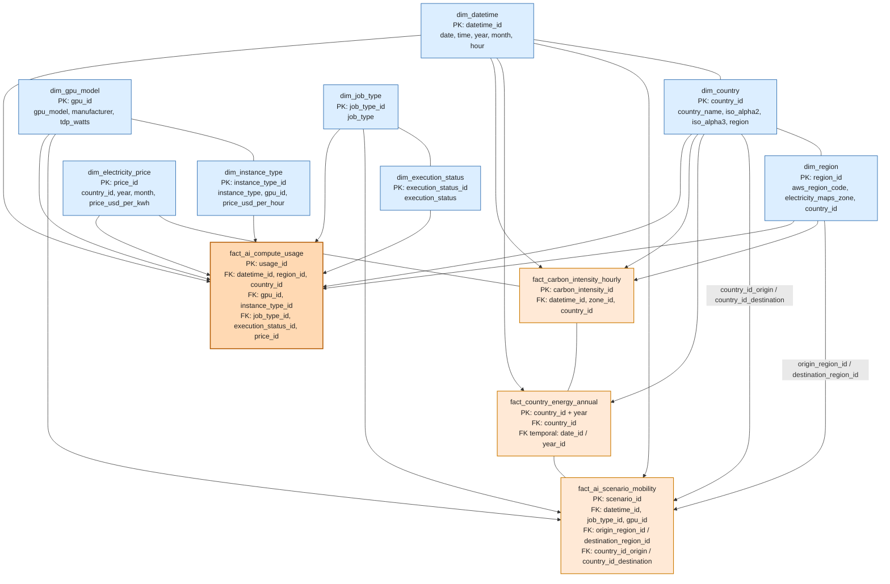

# Modelo dimensional para Green AI

## Resumen

Este documento define el modelo dimensional propuesto para la plataforma Green AI Analytics Platform. Está diseñado para dar soporte a las preguntas de negocio descritas en `docs/PREGUNTAS_DE_NEGOCIO.md` mediante la estructuración de las tablas finales Gold en hechos y dimensiones que cubren:

- Uso de cómputo de IA (sesiones, energía, costos, emisiones)
- Intensidad de carbono y mix eléctrico (datos horarios)
- Indicadores macro y de sostenibilidad por país (datos anuales)

El modelo se construye como un esquema estrella con tablas de dimensiones claras y tablas de hechos.

## Tabla de contenidos

1. [Tablas de dimensiones](#1-tablas-de-dimensiones)
2. [Tablas de hechos](#2-tablas-de-hechos)
3. [Recomendaciones prácticas](#3-recomendaciones-prácticas)
4. [Cobertura de preguntas de negocio](#4-cobertura-de-preguntas-de-negocio)
5. [Descripción del diagrama ER](#5-descripción-del-diagrama-er)
6. [Notas](#6-notas)

---

## 1. Tablas de dimensiones

### `dim_datetime`

Dimensión temporal común para sesiones y series horarias.

- `datetime_id` (PK)
- `date` (YYYY-MM-DD)
- `time` (HH:MM:SS)
- `year`
- `quarter`
- `month`
- `day`
- `day_of_week`
- `hour`
- `is_weekend`
- `calendar_year`
- `fiscal_year` (opcional)
- `utc_timestamp`

### `dim_country`

Dimensión de país para OWID, World Bank, precios eléctricos y datos macro.

- `country_id` (PK)
- `country_name`
- `iso_alpha2`
- `iso_alpha3`
- `iso_numeric`
- `continent`
- `region` (América, Europa, etc.)
- `is_latam` (booleano)
- `is_america` (booleano)
- `currency_code`
- `country_group` (opcional: G20, OECD, etc.)

### `dim_region`

Referencia de región cloud que mapea región AWS, zona de Electricity Maps y país.

- `region_id` (PK)
- `aws_region_code`
- `aws_region_name`
- `electricity_maps_zone`
- `electricity_maps_zone_name`
- `country_id` (FK → `dim_country`)
- `iso_alpha2`
- `iso_alpha3`
- `cloud_provider`
- `cloud_region_type` (p. ej. AWS, GCP, Azure)
- `location_description`
- `latitude`
- `longitude`
- `time_zone`
- `region_group` (p. ej. Latam, North America)
- `reference_source`

Esta dimensión es clave para unir los logs con OWID, Electricity Maps y los precios.

### `dim_gpu_model`

Catálogo de GPUs de MLCO2.

- `gpu_id` (PK)
- `gpu_model`
- `manufacturer`
- `tdp_watts`
- `gflops_fp32`
- `gflops_fp16`
- `gflops_bf16` (opcional)
- `memory_gb`
- `architecture`
- `release_year`
- `notes`

### `dim_instance_type`

Tipo de instancia EC2 usado como proxy de TCO de cómputo.

- `instance_type_id` (PK)
- `provider`
- `instance_type`
- `gpu_id` (FK → `dim_gpu_model`)
- `vcpus`
- `ram_gb`
- `price_usd_per_hour`
- `price_source_date`
- `instance_family`
- `os_type` (Linux)
- `notes`

### `dim_job_type`

Tipo de carga de IA.

- `job_type_id` (PK)
- `job_type` (`Training`, `Fine-tuning`, `Inference`)
- `description`

### `dim_execution_status`

Resultado de ejecución de una sesión.

- `execution_status_id` (PK)
- `execution_status` (`Success`, `Failed`, `Cancelled`, etc.)
- `description`

### `dim_electricity_price`

Referencia de precio eléctrico por país y tiempo.

- `price_id` (PK)
- `country_id` (FK → `dim_country`)
- `year`
- `month` (opcional)
- `price_usd_per_kwh`
- `price_type` (`residential`, `business`, `average`)
- `price_source`
- `price_reference_date`

---

## 2. Tablas de hechos

### `fact_ai_compute_usage`

Esta tabla de hechos almacena registros de sesiones de IA al grano de una fila sintética del log o de una agregación diaria.

Claves:
- `usage_id` (PK)
- `datetime_id` (FK → `dim_datetime`)
- `region_id` (FK → `dim_region`)
- `country_id` (FK → `dim_country`)
- `gpu_id` (FK → `dim_gpu_model`)
- `instance_type_id` (FK → `dim_instance_type`)
- `job_type_id` (FK → `dim_job_type`)
- `execution_status_id` (FK → `dim_execution_status`)
- `price_id` (FK → `dim_electricity_price`, opcional)

Medidas:
- `duration_hours`
- `gpu_utilization`
- `energy_consumed_kwh`
- `energy_consumed_mwh`
- `estimated_energy_kwh`
- `estimated_energy_mwh`
- `emissions_gco2eq`
- `emissions_tco2eq`
- `estimated_emissions_gco2eq`
- `estimated_emissions_tco2eq`
- `cost_electricity_usd`
- `cost_compute_usd`
- `cost_total_usd`
- `co2_per_kwh`
- `cost_per_hour_usd`
- `cost_per_tfop_usd`
- `co2_per_tfop_g`

Esta tabla de hechos soporta:
- movilidad regional y ahorro de CO₂ (pregunta 1)
- eficiencia de GPU y costo ambiental (pregunta 2)
- comparaciones de CO₂ por TFLOP (pregunta 3)
- análisis por tipo de carga y estado de ejecución (pregunta 9)
- actividad regional versus limpieza de la red (pregunta 10)

### `fact_carbon_intensity_hourly`

Captura la intensidad de carbono horaria y el mix eléctrico por zona.

Claves:
- `carbon_intensity_id` (PK)
- `datetime_id` (FK → `dim_datetime`)
- `zone_id` (FK → `dim_region` o `dim_electricity_zone`)
- `country_id` (FK → `dim_country`)
- `is_estimated`
- `emission_factor_type`

Medidas:
- `carbon_intensity_gco2eq_per_kwh`
- `carbon_intensity_tco2eq_per_mwh`
- `carbon_intensity_percentile`
- `is_green_hour_flag`
- `nuclear_mw`
- `solar_mw`
- `wind_mw`
- `coal_mw`
- `gas_mw`
- `other_renewable_mw`
- `total_generation_mw`
- `renewable_share_pct`
- `low_carbon_share_pct`

Esta tabla de hechos soporta:
- ventanas verdes y programación de cargas (pregunta 7)
- ahorros y comparación de escenarios de movilidad (pregunta 1)
- identificación de riesgo de red sucia o limpia (pregunta 8)

### `fact_country_energy_annual`

Indicadores macroenergéticos y económicos anuales por país.

Claves:
- `country_id` (FK → `dim_country`)
- `year`
- `date_id` o `year_id` (FK opcional a `dim_datetime` si se usa fecha de fin de año)

Medidas:
- `population`
- `gdp`
- `gdp_per_capita`
- `carbon_intensity_elec`
- `low_carbon_share_elec`
- `renewables_share_elec`
- `fossil_share_elec`
- `electricity_demand_twh`
- `electricity_generation_twh`
- `exports_tic_usd`
- `exports_tic_growth_pct`
- `energy_per_capita`
- `greenhouse_gas_emissions_mtco2eq`
- `internet_exports_usd` (si está disponible)
- `country_rank` (opcional)

Esta tabla de hechos soporta:
- correlación exportaciones TIC con limpieza de la red (pregunta 4)
- PIB per cápita frente a suministro bajo en carbono (pregunta 5)
- mapeo de riesgo de sostenibilidad por país (pregunta 8)
- volumen país versus intensidad de carbono (pregunta 10)

### `fact_ai_scenario_mobility`

Tabla derivada de escenarios de migración de cómputo de origen a destino.

Claves:
- `scenario_id` (PK)
- `datetime_id`
- `origin_region_id`
- `destination_region_id`
- `job_type_id`
- `gpu_id`
- `country_id_origin`
- `country_id_destination`

Medidas:
- `energy_kwh`
- `co2_origin_gco2eq`
- `co2_destination_gco2eq`
- `co2_savings_gco2eq`
- `co2_savings_tco2eq`
- `percent_reduction`
- `cost_origin_usd`
- `cost_destination_usd`
- `cost_savings_usd`

Esta tabla de hechos es especialmente útil para los análisis de movilidad regional y cambio hacia cargas más verdes (pregunta 1).

---

## 3. Recomendaciones prácticas

- Mantener `dim_region` como referencia única para las uniones entre:
  - `region` de los logs sintéticos,
  - `zone` de Electricity Maps,
  - códigos ISO de OWID / World Bank,
  - y mapeos de país para precios eléctricos.

  Esto se recomienda porque la dimensión `dim_region` actúa como la tabla de referencia que evita inconsistencias en el mapeo geográfico y reduce las uniones frágiles entre datasets que usan diferentes claves de región.

- Almacenar los precios horarios de EC2 en `dim_instance_type` y los precios de electricidad en `dim_electricity_price`.

  Separar estos dos tipos de precio facilita la actualización histórica de tarifas, evita repetir los valores en cada fila de hecho y permite comparar el costo de cómputo con el costo eléctrico de forma independiente.

- Crear vistas Gold que encapsulen la lógica de negocio más usada.

  Estas vistas no son obligatorias, pero sí recomendables para simplificar el consumo analítico:
  - `gold_ai_country_year` — resume energía, emisiones y costo por país y año; ideal para reportes de alto nivel.
  - `gold_gpu_efficiency_by_country` — calcula `usd_per_tfop` y `gco2_per_tfop`; útil para comparar modelos de GPU en contexto regional.
  - `gold_green_hour_windows` — identifica las franjas horarias verdes por región; útil para programación de cargas y recomendaciones de uso.

- Normalizar las unidades de medida de forma estricta.

  Es clave para que los cálculos sean consistentes y fáciles de revisar. Recomendamos:
  - energía en `kWh` y `MWh` (no mezclar sin convertir),
  - emisiones en `gCO2eq` y `tCO2eq`,
  - costos en `USD`.

---

## 4. Cobertura de preguntas de negocio

- Movilidad y ahorro de CO₂ → `fact_ai_compute_usage` + `fact_carbon_intensity_hourly` + `fact_ai_scenario_mobility`
- Elección de GPU y costo ambiental → `dim_gpu_model` + `fact_ai_compute_usage` + `dim_electricity_price`
- Costo de carbono por TFLOP → `fact_ai_compute_usage` + `dim_gpu_model`
- Exportaciones TIC versus limpieza de la red → `fact_country_energy_annual`
- PIB per cápita versus electricidad baja en carbono → `fact_country_energy_annual`
- Escenario +20 % adopción de IA → agregación país desde `fact_ai_compute_usage` y datos de intensidad
- Ventanas verdes de cómputo → `fact_carbon_intensity_hourly`
- Mapeo de riesgo de sostenibilidad → `fact_ai_compute_usage` + `fact_country_energy_annual`

---

## 5. Descripción del diagrama ER

Este diagrama muestra las tablas de hechos y de dimensiones propuestas para el modelo dimensional de Green AI.

## 6. Notas

- Los logs sintéticos son un proxy; los volúmenes absolutos no representan el consumo oficial nacional de IA.
- El mapeo de `region` es crítico: región cloud → país → zona de Electricity Maps → precio / macro datos.
- El modelo debe documentar claramente los supuestos de cada métrica calculada, especialmente al comparar intensidad de carbono horaria con promedios anuales.
